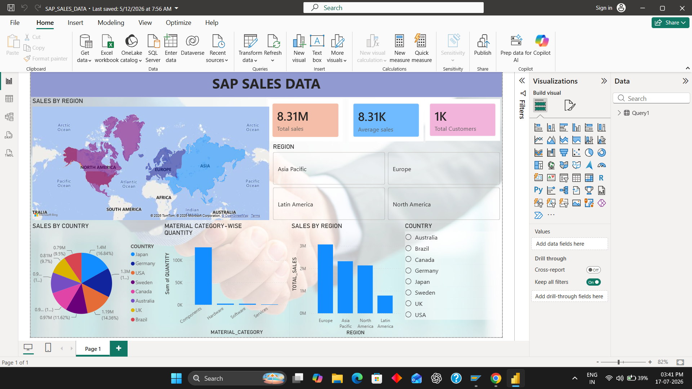

# 📊 Power BI Dashboard

This folder contains the Microsoft Power BI dashboard developed for the **SAP HANA to Power BI End-to-End Sales Analytics Project**.

---

## 📁 Dashboard File

**File Name:**

`SAP_SALES_DATA_DASHBOARD.pbix`

**Download:**

[📥 Download Power BI Dashboard](SAP_SALES_DATA_DASHBOARD.pbix)

> Open this file using **Microsoft Power BI Desktop**.

---

## 📌 Dashboard Features

- 📈 Total Sales KPI
- 💰 Average Sales KPI
- 👥 Total Customers
- 🌍 Sales by Region
- 🌎 Sales by Country
- 📦 Material Category Analysis
- 🎯 Interactive Filters
- 📊 Business Performance Insights

---

## 🛠 Software Used

- Microsoft Power BI Desktop
- SAP HANA Database
- SAP HANA Connector

---

## 📂 Data Source

The dashboard is connected to the sales dataset stored in the SAP HANA database.

Data Flow:

CSV Dataset → SAP HANA Database → Power BI Connector → Interactive Dashboard

---

## 🚀 How to Use

1. Download `SAP_SALES_DATA.pbix.zip`.
2. Extract the ZIP file.
3. Open the `.pbix` file using Microsoft Power BI Desktop.
4. Refresh the data if SAP HANA is running.
5. Explore the interactive dashboard.

---

## 📷 Dashboard Preview

The dashboard preview is available in the **Images** folder.

Image File:

---

## 📌 Dashboard Highlights

- Interactive Business Intelligence Dashboard
- Real-Time Data Visualization
- SAP HANA Integration
- KPI Monitoring
- Sales Performance Analysis
- Geographic Analysis
- Category-wise Analysis

---

## 👨‍💻 Developed By

**Selvamani R**

MBA (HR) | SAP MM | SAP HANA | Power BI | Data Analytics
